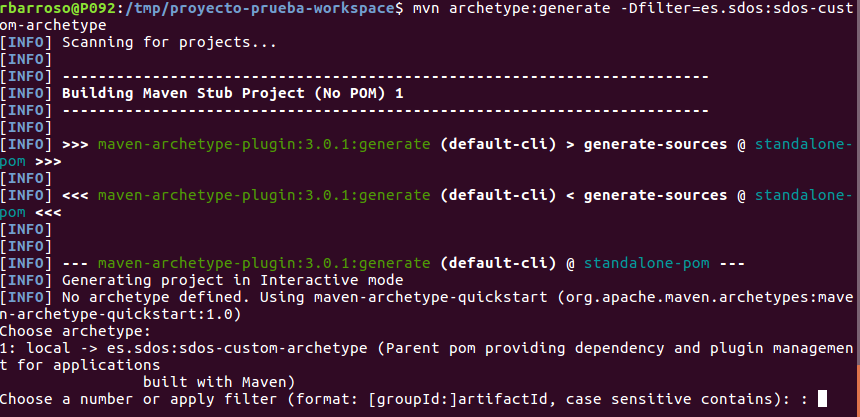

# arquetipo
Crear un arquetipo a partir de un proyecto existente

url: https://sdos.es/blog/como-crear-un-arquetipo-maven-desde-un-proyecto-existente

1. Clonar un proyecto ejemplo
   Utilizaremos una guía de spring boot: https://github.com/spring-guides/gs-spring-boot

Clonamos el proyecto:

git clone https://github.com/spring-guides/gs-spring-boot.git

Lo probamos:

cd gs-spring-boot/initial/
mvn spring-boot:run

Abrimos un navegador web ¡y listo!

2. Modificar el proyecto
   Vamos a modificar el proyecto para que sea nuestro “modelo”. Para ello vamos a cambiar simplemente el mensaje de bienvenida que se encuentra en el archivo ~/gs-spring-boot/initial/src/main/java/hello/HelloController.java.

package hello;

import org.springframework.web.bind.annotation.RestController;
import org.springframework.web.bind.annotation.RequestMapping;

@RestController
public class HelloController {

    @RequestMapping("/")
    public String index() {
        return "Hola arquetipo!!";
    }

}

3. Generar e instalar el arquetipo
   Para generar el arquetipo utilizaremos el Maven Archetype Plugin desde command line. El resultado será una plantilla con los mismos archivos del proyecto desde el cual hemos partido.

Lo primero que haremos es crear un archivo de propiedades para definir el Maven GAV (groupId, artifactId, version) para nuestro arquetipo customizado. Para ello crearemos el archivo ~/gs-spring-boot/initial/my_archetype.properties con el siguiente contenido:

archetype.groupId=es.sdos
archetype.artifactId=sdos-custom-archetype
archetype.package=es.sdos.ca
archetype.version=0.0.1
## groupId por defecto para proyectos generados a partir de este arquetipo
groupId=es.sdos
## artifactId por defecto para proyectos generados a partir de este arquetipo
artifactId=sdos-example

Y ejecutamos la siguiente sentencia:

cd ~/gs-spring-boot/initial
mvn clean archetype:create-from-project -Darchetype.properties="my_archetype.properties"

En este momento ya tenemos el proyecto de tipo arquetipo generado con todos los recursos presentes en el proyecto clonado inicialmente y posteriormente modificado. Vamos a instalarlo en el repositorio local:

cd ~/gs-spring-boot/initial/target/generated-sources/archetype/
mvn install

4. Crear un proyecto nuevo
   Para crear el proyecto, introducimos las siguientes sentencias:

mkdir /tmp/proyecto-prueba-workspace
cd /tmp/proyecto-prueba-workspace/
mvn archetype:generate -Dfilter=es.sdos:sdos-custom-archetype

La consola entrará en modo interactivo, enumerará la lista de arquetipos encontrados en los repositorios configurados otorgándoles un número ordinal. Por ejemplo:

En nuestro caso, seleccionamos el número 1 o que el que corresponda a es.sdos:sdos-custom-archetype. Ahora, seguirá preguntando las propiedades para el nuevo proyecto. Estas deben ser nuestras repuestas:

groupId: es.sdos
artifactId: ejemplo
version: 0.0.1-SNAPSHOT
package: es.sdos (o simplemente pulsamos “enter”)
En este punto nos solicitará una confirmación. Le decimos que sí (“Y”).

5. Probar el proyecto
   Finalmente, para probar el proyecto, ejecutamos las sentencias:

cd /tmp/proyecto-prueba-workspace/ejemplo/
mvn spring-boot:run
